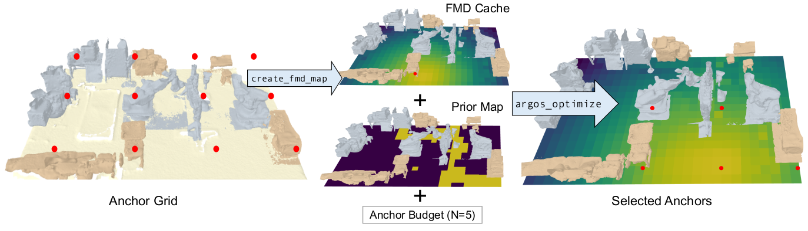

<h1>Argos: Leveraging Visual Priors for Scalable Wireless Navigation in Dynamic Environments</h1>



This artefact demonstrates the anchor selection for a material-aware scalable digital twin of a factory. This repository provides a segmented digital twin of a factory, where users can define the prior path of a movable tag, and the number of anchors required to localize it throughout its journey. Our algorithm provides the optimal subset of anchors and the FMD (which affects the ranging error) map of the deployment. This repository has three folders:
<ol>
	<li>data: collected test data from a factory environment. A material aware 3D model of the factory is provided in the subdirectory visual_priors, covering 14 m × 9 m. UWB Channel Impulse Responses (CIRs), recorded from this environment using QORVO DECAWAVE DW-1000 UWB tags, is provided in the subdirectory rf_priors.</li>
	<li>scripts: scripts for generating ∆FMD caches and optimizers for anchor placement. We have also provided other visualization helpers  and utilities in this directory for visualizing resultant 3D models.</li>
	<li>apps: directory contains user-facing scripts for: (a)generating the ∆FMD cache given an RF-aware 3D model and prior UWB transmitter grid configurations, and (b)finding the optimal anchor subset given an anchor budget and the ∆FMD cache. It also contains helper scripts for the ease-of-use for the user.</li>
</ol>

<h2>Installation and setup</h2>

The code has been developed and tested with **Python 3.10** on **Ubuntu 22.04 LTS**; using the same setup is recommended for reproducibility. The current implementation is compatible **only with Sionna-RT v1.0.1** and is not expected to work with other versions.

### Setup Instructions

1. Install python3.10, python3-venv and llvm (for running Sionna-RT in CPU)
   ```bash
   sudo apt install python3.10
   sudo apt install python3-venv
   sudo apt install llvm
   ```
2. Install git and clone the repository
   ```bash
   sudo apt install git
   git clone https://github.com/senselab-iitm/argos.git
   ```
3. Change directory to project root
   ```bash
   cd argos
   ```   
4. Inside the project root, create a virtual environment  
   ```bash
   python3 -m venv .venv
   ```
5. Enable this virtual environment<br>
	```bash
	source .venv/bin/activate
	```
6. In this virtual environment install necessary packages as specified in `requirements.txt`<br>
	```bash
	pip3 install -r requirements.txt
	```
7. Then make the virtual environment accessible to jupyter lab<br>
	```bash
	python -m ipykernel install --user --name=.venv
	```
8. From this virtual environment, start jupyter lab<br>
	```bash
	jupyter lab
	```

8. Select the .venv kernel in jupyter lab by clicking the `kernel->change kernel menu`. If the `kernel` menu appears disabled/unclickable, open an ipynb notebook from the `app` directory
