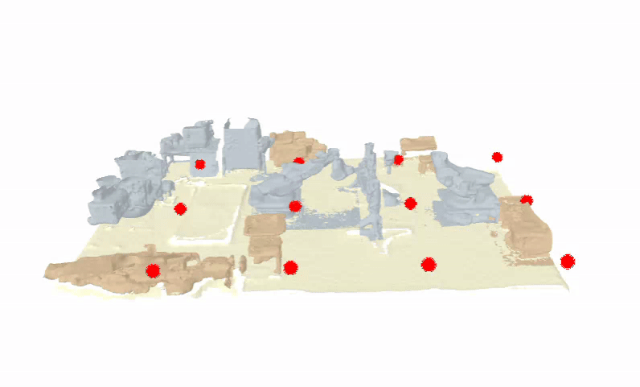

# Argos: Leveraging Visual Priors for Scalable Wireless Navigation in Dynamic Environments</h1>

<p align="center">
  <a href="https://sense.cse.iitm.ac.in/argos/">[ WEBSITE ]</a> |
  <a href="https://github.com/senselab-iitm/argos">[ CODE ]</a> |
  <a href="https://sense.cse.iitm.ac.in/argos/assets/argos_tentative_copy.pdf">[ PAPER ]</a> |
  <a href="https://www.youtube.com/watch?v=NNSm4e_TFxA">[ VIDEO ]</a>
</p>


This artifact demonstrates the anchor selection for a material-aware scalable digital twin of a factory. This repository provides a segmented digital twin of a factory, where users can define the prior path of a movable tag, and the number of anchors required to localize it throughout its journey. Our algorithm provides the optimal subset of anchors and the FMD (which affects the ranging error) map of the deployment. This repository has three folders:
<ol>
	<li>data: collected test data from a factory environment. A material aware 3D model of the factory is provided in the subdirectory visual_priors, covering 14 m × 9 m. UWB Channel Impulse Responses (CIRs), recorded from this environment using QORVO DECAWAVE DW-1000 UWB tags, is provided in the subdirectory rf_priors.</li>
	<li>scripts: scripts for generating ∆FMD caches and optimizers for anchor placement. We have also provided other visualization helpers  and utilities in this directory for visualizing resultant 3D models.</li>
	<li>apps: directory contains user-facing scripts for: (a)generating the ∆FMD cache given an RF-aware 3D model and prior UWB transmitter grid configurations, and (b)finding the optimal anchor subset given an anchor budget and the ∆FMD cache. It also contains helper scripts for the ease-of-use for the user.</li>
</ol>

## Installation and setup

The code supports **Python 3.10 - 3.12** and has been developed and tested with **Python 3.10** on **Ubuntu 22.04 LTS**; using the same setup is recommended for reproducibility. The current implementation is compatible **only with Sionna-RT v1.0.1** and is not expected to work with other versions.

### Setup Instructions

1. Install python3.10, python3-venv and llvm (for running Sionna-RT in CPU)
   ```bash
   sudo apt install python3.10
   sudo apt install python3-venv
   sudo apt install llvm
   ```
2. Install git and clone the repository
   ```bash
   sudo apt install git
   git clone https://github.com/senselab-iitm/argos.git
   ```
3. Change directory to project root
   ```bash
   cd argos
   ```   
4. Inside the project root, create a virtual environment  
   ```bash
   python3 -m venv .venv
   ```
5. Enable this virtual environment<br>
	```bash
	source .venv/bin/activate
	```
6. In this virtual environment install necessary packages as specified in `requirements.txt`<br>
	```bash
	pip3 install -r requirements.txt
	```
7. Then make the virtual environment accessible to jupyter lab<br>
	```bash
	python -m ipykernel install --user --name=.venv
	```
8. From this virtual environment, start jupyter lab<br>
	```bash
	jupyter lab
	```

8. Select the .venv kernel in jupyter lab by clicking the `kernel->change kernel menu`. If the `kernel` menu appears disabled/unclickable, open an ipynb notebook from the `app` directory

## Application Specific Notebooks for Argos
The `app` folder has 4 tools in form of IPYTHON NOTEBOOKS to facilitate clear demonstration.

### create_fmd_map.ipynb

Provides a step-by-step method to initialize an ∆FMD cache<br>
You can define the grid of anchors from which the selection is to be done.



You can also view ∆FMD for each transmitter after it has been computed<br>


### select_anchors.ipynb

Helps the user to perform anchor selection given the ∆FMD cache. It takes in a prior trajectory probability map of mobile nodes and shows the anchors to be deployed in order to achieve superior quality localization given a budget.


### iter_objects.ipynb

A utility which allows the user to iterate through the objects in the scene and view their identifiers for debugging purposes.


### benchmark_updates.ipynb

Benchmarks percentage of updates for the hardware Argos is executing on. Generates a benchmark.csv file in the app folder by updating FMD cache for single Tx with a certain percentage receivers. The meaning of different columns are as follows:
	<ol>
		<li>receiver_selection: Time spent selecting receiver grid points based on the random bitmask.</li><br>
		<li>scene_and_paths: Time spent loading the scene and computing propagation paths.</li><br>
		<li>tap_processing: Time spent extracting and combining multipath channel taps.</li><br>
		<li>real_data_processing: Time spent sampling receivers and computing real-data statistics (mean and variance).</li><br>
		<li>sim_to_dbm: Time spent converting simulated channel energy into received power in dBm.</li><br>
		<li>fusion: Time spent fusing simulated and real signal statistics.</li><br>
		<li>fmd_computation: Time spent computing the Fisher Metric Distance values.</li><br>
		<li>cache_update: Time spent storing computed FMD and RSSI values in the cache.</li><br>
		<li>total: Total time for the full FMD update pipeline.	</li><br>
	</ol>
</ol> 

## Preparing Your Own Scene
1. Create or import any 3D scene into Blender. We have created and exported our models using [Blender 3.6](https://www.blender.org/download/lts/3-6/).
2. If you have multiple objects in the scene you can change its material by changing the material name in Blender, as well as other properties. Please refer to [this part of the mitsuba-blender wiki](https://github.com/mitsuba-renderer/mitsuba-blender/wiki/Exporting-a-Blender-scene) and [this tutorial on material properties](https://docs.blender.org/manual/nb/3.6/render/materials/index.html) for further details on Blender materials and which tweaks are applicable to Mitsuba.
3. In order to use your own 3D model in Sionna-RT, it should be exported as a Mitsuba xml. Kindly refer to the [official mitsuba-blender addon wiki](https://github.com/mitsuba-renderer/mitsuba-blender/wiki) for further details. It is advised to create a fresh directory when exporting the model from Blender. After exporting, the .xml file and meshes folder will be available.
4. For convenience we provide user configurations where this directory can be added. This directory should be passed in the `cfg_mesh_directory` configuration in `configs.py` file. Please see [User Configurations](#user-configurations) section for more details.
5. To tweak object materials independent of blender, we provide the option to add material properties to existing models. For this, another file to be added in this directory,  `material_properties.json`, which takes the following format:

```bash
{
	"object_identifier 1":"material",
	"object_identifier 2":"material",
	...
}
```
The list of materials can be any from the keys of the `ITU_MATERIALS_PROPERTIES` object in [this file](https://github.com/NVlabs/sionna-rt/blob/d0429340b2ee3848e48ed648db9a014dfba22cc8/src/sionna/rt/radio_materials/itu.py) from Sionna-RT. Individual object IDs can be discerned from the [`app/iter_objects.ipynb`](#iter_objectsipynb) notebook.

### User Configurations
Users are provided with configurations in the form of a configs.py file so that user-centric configurations are not tightly coupled with raw code.

#### 1. cfg_mesh_directory
Default value: `"../data/visual_priors/factory/"` for getting the in-house segmented model of our factory testbed.

This directory should contain two things: the mitsuba xml and the meshes, in a subfolder named `meshes`, which are to be imported into Sionna-RT. A `material_properties.json` file should also be provided. Please refer to [Preparing Your Own Scene](#preparing-your-own-scene) section for further details.

#### 2. cfg_cir_path
Default value: `"../data/rf_priors/rx_samples.csv"` for getting the in-house collected CIRs from our factory testbed.

This directory should contain the csv file of collected CIRs with the following essential columns (you can use the columns of the provided default csv file as template):

* _Timestamp_: The UNIX timestamp

* _x_position_: The x coordinate of the tag

* _y_positions_: The y coordinate of the tag

* _FP_Index_: The first path tap index

* _RX_Power_dBm_: The Received Signal Strength (RSS) in dBm

* _I_0,Q_0,Amp_0_ ... _I_n,Q_n,Amp_n_: The I-Q values and the Amplitude of each taps

#### 3. cfg_prior_map
Default value: `"../data/prior_map.npy"`

If you know the prior probabilities of paths a robot will be following, which you have to localize, Argos can optimize the anchor placements according to that. You can create a 2D numpy array to indicate this prior map. The size of the prior map should be cfg_length*2 x cfg_breadth*2.

#### 4. cfg_fmd_cache_name
Default value: `"../data/fmd_cache.json"`

If you have an FMD cache beforehand, you can provide its path. Otherwise, you can generate the FMD cache by using the [`app/create_fmd_map`](#create_fmd_mapipynb) notebook.

#### 5. cfg_scene_length 
Default value: `14`

The length of the scene, along y axis. This length should correspond to the length of the 3D model, as shown in Blender.

#### 6. cfg_scene_breadth
Default value: `9`

The breadth of the scene, along x axis. This length should correspond to the length of the 3D model, as shown in Blender.

#### 7. cfg_tx_grid_length
Default value: `4`

For our example, we are treating the pre-deployed anchors to be in a grid. Number of anchors along the length of the scene is provided here.

#### 8. cfg_tx_grid_breadth
Default value: `3`

For our example, we are treating the pre-deployed anchors to be in a grid. Number of anchors along the breadth of the scene is provided here.

#### 9. cfg_bounding_box_name
Default value: `"elm__28"`

If the scene has a bounding box, the object ID of that. Object ID of the bounding box can be discerned from the [`app/iter_objects.ipynb`](#iter_objectsipynb) notebook.

#### 10. cfg_set_bounding_box_transparent
Default value: `True`

If you do not wish to see the bounding box in the notebooks, so that other elements can be properly seen. Does not affect ray tracing results.

#### 11. cfg_floor_name
Default value: `"elm__6"`

If the scene has a floor, the object ID of that. Object ID of the floor can be discerned from the [`app/iter_objects.ipynb`](#iter_objectsipynb) notebook.

#### 12. cfg_set_floor_transparent
Default value: `True`

If you do not wish to see the floor in the notebooks, so that the FMD maps can be properly seen. Does not affect ray tracing results.

#### 13. cfg_clip_at 
Default value: `1`

Position of a clipping plane which cuts through the scene and shows the objects below it. Useful for clipping ceiling of a bounding box. Does not affect ray tracing results.

#### 14. cfg_clip_plane_orientation
Default value: `(0,-1.9,0)`

Orientation of the clipping plane which cuts through the scene and shows the objects below it. Useful for clipping ceiling of a bounding box. Does not affect ray tracing results.

#### 15. cfg_color_dict 
Default value: 	`{
    "metal":(0.60, 0.65, 0.70),
    "wood":(0.76, 0.60, 0.42),
    "marble":(0.98, 0.95, 0.75),
    "concrete":(0.75, 0.75, 0.75)
}`

The individual colors of each material. Each tuple refers to R,G,B in the range 0-1.
