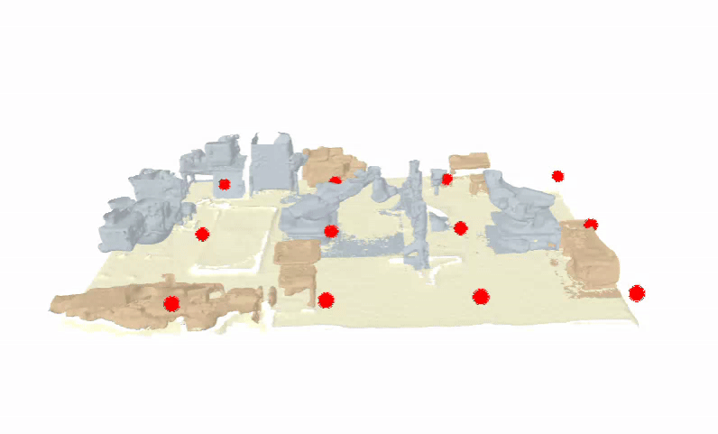

<h1>Application Specific Notebooks for Argos</h1>
The app folder has 4 tools in form of IPYTHON NOTEBOOKS to facilitate clear demonstration.
<ol>
<li>create_fmd_map.ipynb: provides a step-by-step method to initialize an ∆FMD cache 
You can define the grid of anchors from which the selection is to be done. 

 
You can also view ∆FMD for each transmitter after it has been computed 

 

</li> 

<li>argos_optimize.ipynb: helps the user to perform anchor selection given the ∆FMD cache. It takes in a prior trajectory probability map of mobile nodes and shows the anchors to be deployed in order to achieve superior quality localization given a budget. 

 

</li> 

<li>iter_objects.ipynb: a utility which allows the user to iterate through the objects in the scene and view their identifiers for debugging purposes.

 

</li> 

<li>benchmark_updates.ipynb: benchmarks percentage of updates for the hardware Argos is executing on. Generates a benchmark.csv file in the app folder by updating FMD cache for single Tx with a certain percentage receivers. The meaning of different columns are as follows:
	<ol>
		<li>receiver_selection: Time spent selecting receiver grid points based on the random bitmask.</li> 
		<li>scene_and_paths: Time spent loading the scene and computing propagation paths.</li> 
		<li>tap_processing: Time spent extracting and combining multipath channel taps.</li> 
		<li>real_data_processing: Time spent sampling receivers and computing real-data statistics (mean and variance).</li> 
		<li>sim_to_dbm: Time spent converting simulated channel energy into received power in dBm.</li> 
		<li>fusion: Time spent fusing simulated and real signal statistics.</li> 
		<li>fmd_computation: Time spent computing the Fisher Metric Distance values.</li> 
		<li>cache_update: Time spent storing computed FMD and RSSI values in the cache.</li> 
		<li>total: Total time for the full FMD update pipeline.	</li> 
	</ol>
</ol> 
Users are provided with configurations in the form of a configs.py file so that user-centric configurations are not tightly coupled with
raw code.
